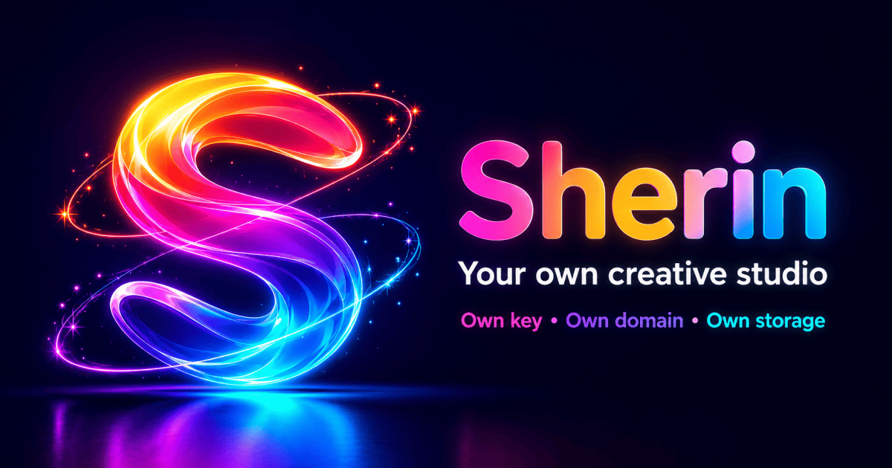
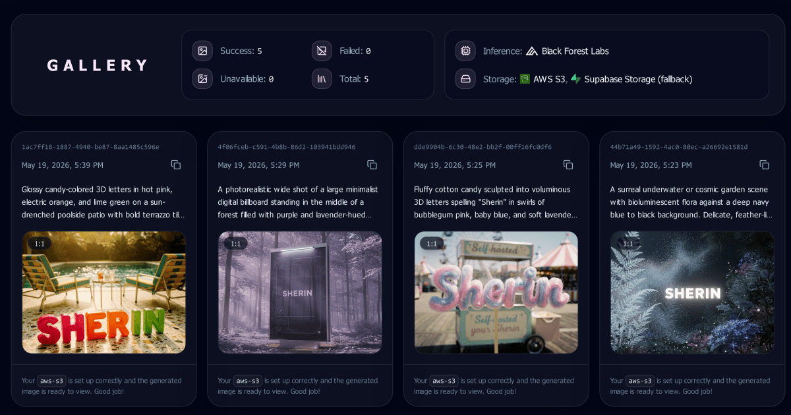

<div align="center">

<p>
  
</p>

<h1>
  Sherin
</h1>

<p>
  Self-hosted private workspace for generative media with own key, domain, and storage.
</p>

<p>
  <strong>Own key • Own domain • Own storage</strong>
</p>

<br />

<strong>Quick links</strong>

[](https://demo.sherin.babysea.live)

<br />

<strong>Project details</strong>

[](#babysea-oss-taxonomy)
[](#status)
[](LICENSE)

<br/>

<strong>Assistants & bots</strong>


<br/>

<strong>Checks</strong>

[](https://gitlab.com/babysea/sherin/-/commits/main)
[](https://dl.circleci.com/status-badge/redirect/circleci/2uTLcwc4naeNuKDP41es88/UVW4ijtkbzrFah5yHrnaQ2/tree/main)
[](https://codecov.io/github/babysea-community/sherin)
[](https://github.com/babysea-community/sherin/actions/workflows/sentry-check.yml)
[](https://github.com/babysea-community/sherin/actions/workflows/codeql.yml)
[](https://github.com/babysea-community/sherin/actions/workflows/publish-check.yml)

<br/>

<strong>Built with</strong>

[](https://nextjs.org)
[](https://react.dev)
[](https://babysea.ai)
[](https://bfl.ai)
[](https://supabase.com)
[](https://aws.amazon.com)
[](https://www.cloudflare.com)
[](https://sentry.io)
[](https://www.netlify.com)
[](https://vercel.com)

<br/>

<strong>One-click deploy</strong>

[](https://app.netlify.com/start/deploy?repository=https://github.com/babysea-community/sherin)
[](https://vercel.com/new/clone?repository-url=https%3A%2F%2Fgithub.com%2Fbabysea-community%2Fsherin&project-name=sherin&repository-name=sherin&env=NEXT_PUBLIC_SITE_URL,OWNER_EMAIL,NEXT_PUBLIC_SUPABASE_URL,NEXT_PUBLIC_SUPABASE_PUBLIC_KEY,SUPABASE_SECRET_KEY,INFERENCE_PROVIDER,BFL_API_KEY,BFL_API_BASE_URL,BABYSEA_API_KEY,BABYSEA_API_BASE_URL,STORAGE_PROVIDER,CUSTOM_USER_STORAGE_QUOTA_GB)

<br />



<br />



</div>

<br />

## BabySea OSS taxonomy

BabySea open source projects are organized into three categories:

[](#babysea-oss-taxonomy)
[](#babysea-oss-taxonomy)
[](#babysea-oss-taxonomy)

| Category      | Description                                                                                                                                       |
| :------------ | :------------------------------------------------------------------------------------------------------------------------------------------------ |
| **SDK**       | Typed developer entry points for creating, tracking, and managing BabySea workloads from application code.                                        |
| **Primitive** | Reusable infrastructure boundaries extracted from BabySea's execution control plane. Each primitive focuses on one system concern.                |
| **Starter**   | Deployable reference applications that combine product UI, auth, storage, and BabySea execution patterns. Some starters may also include billing. |

## Status

BabySea OSS projects are published into three status levels:

[](#status)
[](#status)
[](#status)

| Status         | Description                                                                                                                                                                          |
| :------------- | :----------------------------------------------------------------------------------------------------------------------------------------------------------------------------------- |
| **Working**    | Fully implemented and deployable. All documented capabilities function as described. Suitable for personal and small-team use. No breaking-change guarantees between versions.       |
| **Production** | Working plus a hardened public runtime contract. Validated against a stated infrastructure stack with deterministic behavior, explicit failure modes, and a documented upgrade path. |
| **Alpha**      | Early-stage implementation. Core structure exists but some capabilities may be incomplete, undocumented, or subject to breaking changes. Not recommended for production deployments. |

See [`CHANGELOG.md`](CHANGELOG.md) to track releases and public contract changes.

---

## Quick Start

Run locally:

```bash
git clone https://github.com/babysea-community/sherin.git
cd sherin
pnpm install --frozen-lockfile
cp .env.example .env.local
```

Fill `.env.local` from [`.env.example`](.env.example), apply [`001_sherin.sql`](supabase/migrations/001_sherin.sql), then start the app:

For local sign-in, add `http://localhost:3012/auth/callback` to Supabase Auth Redirect URLs.

```bash
pnpm run doctor
pnpm dev
```

Open <http://localhost:3012>.

## Inference And Storage

Set `OWNER_EMAIL` to the one Google account allowed into the dashboard.

Set `INFERENCE_PROVIDER=bfl` for direct Black Forest Labs execution, or `INFERENCE_PROVIDER=babysea` for BabySea SDK execution. Provide the matching `BFL_API_KEY` or `BABYSEA_API_KEY` server-side.

Set `STORAGE_PROVIDER=supabase-storage`, `vercel-blob`, `cloudflare-r2`, or `aws-s3`. Supabase Storage is the default and fallback path.

Supported model names and provider fields are registered in [`lib/app-config.ts`](lib/app-config.ts), [`lib/inference/bfl/models.ts`](lib/inference/bfl/models.ts), and [`lib/inference/babysea/models.ts`](lib/inference/babysea/models.ts).

## Workspace

| Surface    | Purpose                                                                             |
| :--------- | :---------------------------------------------------------------------------------- |
| Studio     | Prompt, select a model, tune generation fields, upload references, and start jobs.  |
| Gallery    | Review completed, failed, unavailable, and in-flight generation records.            |
| References | Store uploaded and URL-based input images that can be reused in later generations.  |
| Usage      | Inspect provider, storage, queue, and quota state for the private workspace.        |
| Profile    | Review owner and deployment settings visible to the signed-in workspace owner only. |

## Runtime

- Sherin is owner-only. Supabase Google OAuth signs users in, and `OWNER_EMAIL` gates dashboard access.
- Provider credentials, storage credentials, Supabase service role keys, Sentry auth tokens, and cron secrets stay server-side.
- Generation records, prompts, statuses, provider metadata, storage URLs, reference images, and profile state persist in Supabase Postgres.
- Studio, Gallery, References, and Usage can process queued/running generations. `/api/generations/process` can also be called by cron with `Authorization: Bearer CRON_SECRET`.
- Sherin is not a managed BabySea service, commercial support package, hosting service, billing starter, credit ledger, provider marketplace, or multi-tenant team workspace.

## Deployment

### Vercel

Keep the checked-in [`vercel.json`](vercel.json) framework settings. Configure Supabase auth callback URLs with the final Vercel domain or custom domain, then redeploy after changing env values.

### Netlify

[`netlify.toml`](netlify.toml) builds with `pnpm build` and the Next.js plugin. Prefer Supabase Storage, Cloudflare R2, or AWS S3 on Netlify; if you intentionally use Vercel Blob outside Vercel, validate it with `STORAGE_SMOKE_TEST=1 pnpm run doctor`.

### Scheduler

Use an external scheduler for `GET /api/generations/process` when you want background recovery without opening the dashboard. Send `Authorization: Bearer <CRON_SECRET>` and keep the frequency low enough to avoid `429` responses.

## Customize

| Change     | Files                                                                                                                                   |
| :--------- | :-------------------------------------------------------------------------------------------------------------------------------------- |
| UI         | `app/page.tsx`, `app/access/page.tsx`, `app/dashboard/**`                                                                               |
| Auth       | `lib/auth/owner.ts`, `app/access/_lib/server-actions.ts`, `supabase/migrations/001_sherin.sql`                                          |
| Models     | `lib/app-config.ts`, `lib/inference/bfl/models.ts`, `lib/inference/babysea/models.ts`, `test/sherin-models.test.ts`                     |
| Inference  | `lib/inference/index.ts`, `lib/inference/bfl/server-actions.ts`, `lib/inference/babysea/server-actions.ts`                              |
| Storage    | `lib/storage/index.ts`, `lib/storage/*/server-actions.ts`, `lib/storage/s3-compatible-storage.ts`, `supabase/migrations/001_sherin.sql` |
| Worker     | `app/dashboard/studio/_lib/generation-worker.ts`, `app/api/generations/process/route.ts`                                                |
| Monitoring | `instrumentation.ts`, `instrumentation-client.ts`, `lib/monitoring`, `scripts/sentry-project-check.mjs`                                 |
| Deploy     | `.env.example`, `netlify.toml`, `vercel.json`, `scripts/doctor.mjs`                                                                     |

## Troubleshooting

| Symptom                             | Fix                                                                                                                 |
| :---------------------------------- | :------------------------------------------------------------------------------------------------------------------ |
| `doctor` fails                      | Read the missing env var or file printed by `doctor`; env names live in [`.env.example`](.env.example).             |
| Sign-in works but access is denied  | Check that `OWNER_EMAIL` exactly matches your Google account email.                                                 |
| Supabase redirects to the wrong URL | Align `NEXT_PUBLIC_SITE_URL`, Supabase Site URL, and Supabase Redirect URLs.                                        |
| Image generation does not start     | Verify `INFERENCE_PROVIDER` and the matching `BFL_API_KEY` or `BABYSEA_API_KEY`.                                    |
| Image shows as unavailable          | Generation succeeded but the stored file URL cannot be resolved; check `STORAGE_PROVIDER` and storage credentials.  |
| Jobs stay queued or running         | Open Studio, Gallery, References, or Usage to trigger processing, or configure cron for `/api/generations/process`. |
| Worker returns 401                  | Send `Authorization: Bearer <CRON_SECRET>` and rotate the token if it may have leaked.                              |
| Worker returns 429                  | Reduce cron frequency or owner-triggered flushes; honor the `Retry-After` response header.                          |
| Sentry source maps are not uploaded | Confirm `SENTRY_ORG`, `SENTRY_PROJECT`, and `SENTRY_AUTH_TOKEN` exist only in build/CI secrets.                     |

## Community

Sherin is an Apache-2.0 open-source starter in [`babysea-community/sherin`](https://github.com/babysea-community/sherin). Issues, pull requests, design discussion, and security reports should follow [`CONTRIBUTING.md`](CONTRIBUTING.md), [`CODE_OF_CONDUCT.md`](CODE_OF_CONDUCT.md), and [`SECURITY.md`](SECURITY.md).

## License

[Apache License 2.0](LICENSE). Use it, fork it, ship it. Just keep the notice.
